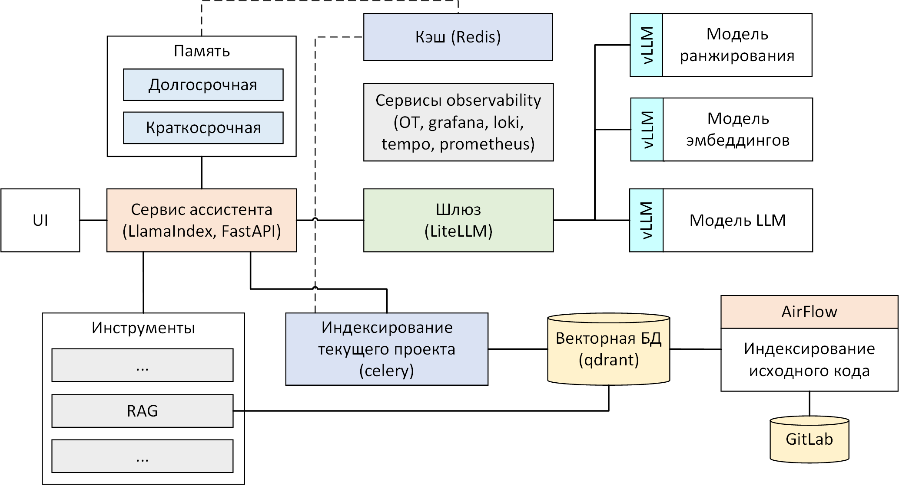

# Ассистент разработчика с применением RAG

AI-ассистент для разработки ПО представляет собой автономный агент с поддержкой вызова инструментов для поиска по коду, чтения и редактирования файлов, выполнения команд в терминале и других задач. Поиск по исходному коду проектов реализована через RAG (Retrieval-Augmented Generation). Для более качественного разбиения файлов исходного кода на фрагменты применяется алгоритм AST Splitter. Взаимодействие с ассистентом производится через UI на базе HTML-страницы.

В состав также входит оператор для **Apache Airflow**, предназначенный для периодической индексации репозиториев GitLab в векторную базу Qdrant.

## Возможности

- **Поиск по кодовой базе** - семантический поиск с помощью RAG
- **Работа с файлами** - чтение, создание и редактирование файлов проекта
- **Терминал** - выполнение команд в терминале
- **Кэлькулятор** - арифметические вычисления
- **Подтверждение действий** - пользователь контролирует вызов инструментов путем явного подтверждения
- **Многофайловые вложения** - указание файлов через `@путь` для встраивания в контекст модели
- **Мультисессийность** - независимые сессии с сохранением истории, краткосрочной и долгосрочной памятью
- **Асинхронная индексация проекта** - индексация текущего проекта в векторную базу
- **Индексация GitLab-репозиториев** - периодическая индексация репозиториев GitLab

## Архитектура



### Стек технологий

| Компонент       | Технология            |
|-----------------|-----------------------|
| Бэкенд          | Python, FastAPI       |
| Агент           | LlamaIndex            |
| Векторная БД    | Qdrant                |
| Брокер задач    | Redis + Celery        |
| Инференс-движок | vLLM, либо llama.cpp  |
| Проксирование   | LiteLLM               |
| Фронтенд        | Vue, TypeScript       |
| Парсер          | tree-sitter           |
| Наблюдаемость   | OpenTelemetry, Prometheus, Grafana, Loki, Tempo  |

## Структура проекта

```
.
├── airflow/                    # Оператор Apache Airflow для индексации репозиториев GitLab
│   ├── Dockerfile              # Образ airflow
│   ├── dags/                   # DAG-файлы
│   │   └── gitlab_indexer.py   # Задача индексации репозиториев GitLab
├── dev-assistant/              # Сервис ассистента (FastAPI + LlamaIndex)
│   ├── dev_assistant/          
│   │   ├── __main__.py         # Точка входа в программу-ассистент
│   │   ├── agent.py            # Реализация агента
│   │   ├── server.py           # API-сервер
│   │   ├── rag.py              # RAG (клиент Qdrant, индексация)
│   │   ├── chunking.py         # Реализация алгоритма AST Splitter
│   │   ├── config.py           # Управление конфигурацией
│   │   ├── celery_app.py       # Приложение Celery
│   │   ├── celery_tasks.py     # Задача по индексации рабочего проекта
│   │   ├── tools/              # Доступные для агента инструменты
│   │       ├── calculator.py   # Калькулятор
│   │       ├── create_file.py  # Инструмент для создания/перезаписи файлов
│   │       ├── edit_file.py    # Инструмент для редактирования существующих файлов
│   │       ├── find_file.py    # Инструмент поиска файлов по шаблону имени
│   │       ├── list_files.py   # Инструмент для вывода содержимого каталогов
│   │       ├── read_file.py    # Инструмент для чтения файлов
│   │       ├── terminal.py     # Инструмент для выполнения команды терминала
│   │       └── utils.py        # Вспомогательные функции
│   ├── pyproject.toml          # Файл проекта
├── dev-assistant-ui/           # Фронтенд (Vue, TypeScript)
│   ├── mock
│   │   └── api.mock.ts         # Мок для тестирования API
│   ├── src
│   │   ├── App.vue             # Корневой компонент
│   │   ├── FileList.vue        # Список файлов проекта (для включения в контекст)
│   │   ├── HistoryList.vue     # Компонент списка чатов
│   │   ├── Messages.vue        # Компонент диалога с ассистентом (список сообщения)
│   │   ├── Prompt.vue          # Компонент поля ввода в диалоге
│   │   ├── Settings.vue        # Диалог настроек
│   │   ├── chat.ts             # Функционал чата
│   │   ├── debounce.ts         # Функция debounce для событий ввода
│   │   ├── events.ts           # Типы событий
│   │   ├── main.ts             # Точка входа в приложение
│   │   ├── types.ts            # Интерфейсы и т.п.
│   │   └── utils.ts            # Утилитные функции
├── etc/                        # Файлы конфигурации (vLLM, LiteLLM, OTel и т.д.)
└── ir-benchmark/               # Бенчмарк алгоритмов сегментации кода
│   ├── BuildDataset            # Вспомогательная программа для построения датасета
│   ├── calc_metrics.ipynb      # Вычисление метрик поиска
│   └── make_dataset.ipynb      # Построение датасета (по данным от вспомогательной программы)
├── llm-benchmark               # Бенчмарк замера производительности генерации LLM
│   ├── Dockerfile              # Образ для выполнения запросов из бенчмарка
├── vllm-cuda/                  # Исправление Docker-образа vLLM для CUDA
├── docker-compose.yaml         # Запуск инфраструктуры с использованием vLLM
├── docker-compose.llama.yaml   # Альтернатива с использованием llama.cpp
├── docker-compose.airflow.yaml # Запуск Airflow для индексации репозиториев GitLab
```

## Запуск

### Требования

- Docker и Docker Compose
- NVIDIA GPU с драйверами
- `uv` - менеджер пакетов Python
- Node.js 20+ (для сборки UI)

### Запуск всех сервисов

**Вариант 1: vLLM (рекомендуется)**

Предварительно настройте параметры в `.env` на основе примера `.env.example`.

```bash
docker compose up -d
```

**Вариант 2: llama.cpp**

```bash
docker compose -f docker-compose.llama.yaml up -d
```

Сервис ассистента запускается на машине разработчика. 
```bash
cd dev-assistant
# Предварительно настройте параметры в .env на основе примера .env.example.
uv sync
uv run -m dev_assistant &
uv run celery -A dev_assistant.celery_app worker --concurrency=3 -P solo &
```

**Запуск Airflow**

```bash
docker compose -f docker-compose.airflow.yaml up -d
```

Веб-интерфейс Airflow доступен на `http://localhost:8080` (логин/пароль: `airflow`/`airflow`).

### Сборка UI

```bash
cd dev-assistant-ui
npm install
npm run build
```

Результат сборки будет доступен в `dist/chat.html`.

## Переменные окружения

Полные списки переменных - в `.env.example` и `dev-assistant/.env.example`.

### dev-assistant

| Переменная              | Описание                                   | Значение по умолчанию      |
|-------------------------|--------------------------------------------|----------------------------|
| `API_BASE_URL`          | Адрес LiteLLM                              | Заполняется пользователем (обязательно) |
| `QDRANT_URL`            | Адрес Qdrant                               | Заполняется пользователем (обязательно) |
| `REDIS_URL`             | Адрес Redis (для Celery, памяти)           | `redis://localhost:6379/0` |
| `PROXY_URL`             | HTTP-прокси                                | - (необязательно, для отладки) |
| `OTEL_SERVICE_NAME`     | Название сервиса для служб observability   | `dev-assistant`            |
| `OTEL_EXPORTER_OTLP_ENDPOINT` | Адрес OpenTelemetry Collector        | `http://localhost:4317`    |
| `RAG_TOP_K`             | Количество возвращаемых фрагментов         | 10                         |
| `RAG_CHUNK_SIZE`        | Размер фрагмента при обработке файлов кода | 256                        |

### Root `.env` (vLLM, Airflow, индексация)

| Переменная              | Описание                                 | Значение по умолчанию      |
|-------------------------|------------------------------------------|----------------------------|
| `VLLM_LLM_MODEL`        | Основная LLM-модель                      | Заполняется пользователем (обязательно) |
| `VLLM_LLM_DRAFT_MODEL`  | Черновая модель для Speculative Decoding | -                          |
| `VLLM_EMB_MODEL`        | Модель эмбеддингов                       | Заполняется пользователем (обязательно) |
| `VLLM_RANK_MODEL`       | Модель ранжирования                      | Заполняется пользователем (обязательно) |
| `VLLM_GPU_DEVICE`       | Номер GPU для vLLM                       | 0                          |
| `GITLAB_URL`            | Адрес GitLab для индексации              | Заполняется пользователем (обязательно) |
| `GITLAB_TOKEN`          | Токен доступа к GitLab                   | Заполняется пользователем (обязательно) |
| `GITLAB_FILE_FILTER`    | Фильтр файлов для индексации (через `;`) | `*.*`                      |
| `AIRFLOW_PROJ_DIR`      | Каталог с файлами для Airflow            | `./airflow`                |

## Службы observability

Система включает следующий стек observability:
- **Prometheus** - сбор метрик (включая vLLM)
- **Grafana** - дашборды
- **Loki** - сбор логов
- **Tempo** - сбор трассировок запросов
- **OTel Collector** - единая точка сбора метрик, логов, трассировок с сервисов

## IR-бенчмарк

Директория `ir-benchmark/` содержит бенчмарк для оценки качества извлечения документов по описаниям типов, методов, либо функций. Сравниваются стандартные алгоритмы сегментации из библиотеки LlamaIndex с представленным в работе алгоритмом AST Splitter, а также оценивается гибридный поиск и ранжирование ответов. См. подробнее [здесь](ir-benchmark/README.md).

## Оценка производительности генерации

Директория `llm-benchmark/` содержит бенчмарк для оценки скорости генерации в зависимости от различного количества черновых токенов в подходе Speculative Decoding. См. подробнее [здесь](llm-benchmark/README.md).

## Лицензия

MIT
